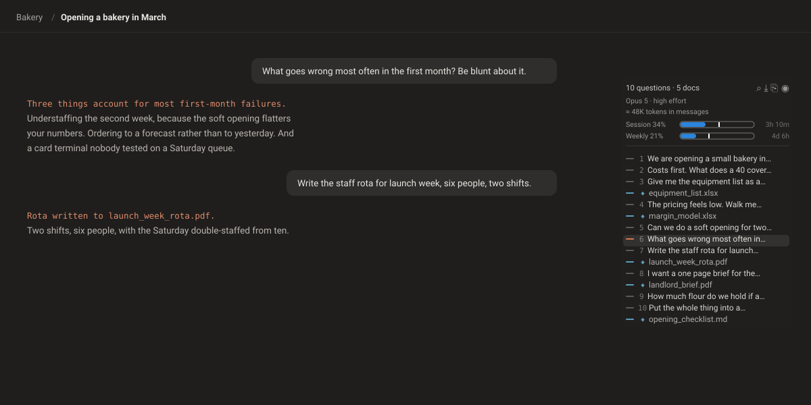

# Prompt Navigator for Claude

A rail down the right edge of a Claude chat listing every question you asked, first to last, with the documents that thread produced marked in place. Click one to jump to it. The header shows which model and effort the chat is on, how big the conversation has grown, and how much of your plan you have used.

Ships with a companion meter for ChatGPT that shows your agent and task allowance, and a prompt advisor for both sites that says which model and effort level a prompt needs before you send it.

Works as a Chrome extension or as two Tampermonkey userscripts. The files are the same either way.

*Interface drawn from the shipped stylesheet, with a demo conversation standing in for a real one. No account data appears in this repository.*

---

## What it shows

**On `claude.ai`**

- Every question in the thread, numbered, read from Claude's own conversation API rather than the page — the page only ever holds three to five of them at a time
- Documents Claude wrote, placed after the question that produced them. A solid marker is a file that still exists, and clicking it opens the file in Claude's own viewer. A hollow one was created and has since been cleared from the sandbox, so there is nothing to open and clicking takes you to the question that made it instead
- In a Cowork session, every file that session produced, read from its Outputs panel. Click one to open it
- The model and effort the chat is running, read live, so switching either updates the header
- How much context a thread is using. In Cowork this is exact, read from the session log, with a marker where the session will compact. In chat it is a band, plenty of room, getting long or near compaction, because chat does not report its own usage
- The handoff button lights up when a thread is close to compacting, or already has
- Session and weekly plan usage, with a marker showing how much of each window has elapsed
- A search palette over the questions themselves, across every thread, not just this one. Press **Alt+K** or click `⌕` in the rail header. Results from the open thread come first. Picking one from another thread opens it and jumps straight to that question

> Alt+K, not Ctrl+K, because Ctrl+K is claude.ai's own palette and binding over it would have taken away a feature you already use. The two do different jobs: Claude's finds threads by title, this one finds the questions inside them.

**On `chatgpt.com`**

- Plan type and the agent/task usage window, with the same elapsed-time marker
- In a conversation, roughly how many tokens the chat holds. A size only, with no percentage, because ChatGPT reports no usage and OpenAI publishes no context window for ChatGPT plans. It turns amber if ChatGPT marks the chat as trimmed

**On both sites, as you type**

- One line above the text box when the model or effort you picked is heavier or lighter than the prompt needs, such as **Sonnet 5.5 · Medium would do this**. Hover it for the audit behind the call
- A dim "High fits this" line when your pick already fits, so a quiet hint never has to mean either "agreed" or "not working"
- In an existing thread, a follow-up such as "now do the same for sem 4" is judged by the question it follows, because its difficulty lives in the thread, not in its own words
- As the thread grows it weighs the thread too. A new task on a long thread, any switch of model or effort on a thread past about 20K tokens, and every prompt near compaction get a suggestion to move to a new chat, with a **Summarise** button that puts a short handover request in the box and keeps your prompt at the end. A follow-up on a long thread gets a one-time "wrap up soon". Work that draws on the whole thread, such as "consolidate everything above", stays in the thread and gets a step more effort instead
- It never switches anything for you and never sends the prompt anywhere

It scores each prompt on two separate axes, because model and effort buy different things. The kind of thinking picks the model: a rewrite or summary needs no judgment, writing and analysis sit with Sonnet, and a decision with trade-offs or stakes goes to Opus. The depth of reasoning picks the effort: steps that depend on each other, constraints to hold at once, sums to check, a bug to trace.

| | One shot | Some steps | Many steps | Hard |
|---|---|---|---|---|
| **Transform** (rewrite, summarise, translate, extract) | Haiku 4.5 | Sonnet 5.5 · Low | Sonnet 5.5 · Medium | Sonnet 5.5 · High |
| **Create or analyse** (write, explain, code, plan) | Sonnet 5.5 · Low | Sonnet 5.5 · Medium | Sonnet 5.5 · High | Opus 5.5 · High |
| **Judgment** (should we, trade-offs, critique, strategy) | Opus 5.5 · Medium | Opus 5.5 · Medium | Opus 5.5 · High | Opus 5.5 · High |

The grid follows Anthropic's own guidance, checked on 30 September 2026. Medium is the default on Opus 5.5, and on Sonnet 5.5 in the apps. High is for complex reasoning. Extra is described as "designed for long-running coding and agentic tasks", which a chat prompt is not, so it is not suggested, and neither is Max. When the hint suggests a smaller model, the hover card also names the same step down in effort on the model you already have, because Anthropic says "tuning effort is often a better lever than switching models".

Stakes move a prompt in the direction its errors come from. On writing or analysis about fees, contracts, hiring or accreditation the model goes up, because a wrong call there is a judgment error. On a calculation about the same things the effort goes up instead, because a wrong sum is a slipped step, and a bigger model doesn't prevent that. Max effort and Fable 5.1 are never suggested. The picker itself warns that Max costs 5.5 times or more. Anthropic points to Fable 5.1 for problems Opus has already struggled with, which a single prompt cannot show, and on Pro it draws on usage credits.

Why a switch on a big thread becomes "move to a new chat": changing model or effort mid-thread makes the next reply reread the whole thread without the prompt cache, per Claude's prompt caching docs. Past a modest size, a 400-word handover in a fresh chat is cheaper than that reread.

On ChatGPT, Chat mode has one model for Plus, GPT-5.6 Sol, so only its three effort steps are advised: Instant, Medium and High. Work mode, and Codex in the desktop app, get model advice too, following OpenAI's own guidance: GPT-6 Luna at High for summaries and extraction, GPT-6.1 Sol from Light to High for most work, and GPT-6 Astra at Light for the hardest multi-step tasks. GPT-6.1 Sol came out on 29 September 2026 for Work and Codex only. Max, Ultra and the undocumented None, Minimal and Persistent steps are never suggested. ChatGPT publishes no context window, so there the only new-chat signal is ChatGPT's own flag that it trimmed earlier turns.

The thread size and earlier questions come from the Prompt Navigator and the ChatGPT meter. Without them the advisor still judges new chats, but stays quiet on follow-ups rather than guess.

**In the Claude and ChatGPT desktop apps**

The same hint, from a small companion in the tray. Both desktop apps are Chromium inside signed Store packages, so nothing can be added to them. The companion reads them from outside through Windows UI Automation, the interface screen readers use: the text box you are typing in and the model button beside it. It runs the same rules as the extension, loaded from `prompt-advisor.user.js` itself, and draws the answer as one line above the text box. It never types or clicks in the apps and never touches the network.

It reads effort as well as model. In the Claude app effort sits on its own button beside the model, "Effort: High", and the companion reads the two together. Hover the hint for what the suggested effort level is for, in Anthropic's or OpenAI's own words.

One gap: ChatGPT's desktop Chat tab names its picker "Select ChatGPT model" and exposes nothing inside it, so your thinking level cannot be read there. In that tab the hint names the level the prompt needs, such as "Instant thinking suits this", and leaves the comparison to you. Work mode and Codex show the level on the button and are compared as usual.

What it reads is noted, one line per change, in `%TEMP%\PromptAdvisor-reads.log`: the app, the button names and how many characters are in the box, never the text itself.

It gives prompt-level advice only. Follow-ups, thread length and the new-chat suggestion need the conversation, which the desktop apps do not expose, so those stay in the browser.

---

## Install as a Chrome extension

1. Download or clone this repository
2. Open `chrome://extensions`
3. Turn on **Developer mode**, top right
4. Click **Load unpacked** and choose the repository folder
5. Reload any open Claude or ChatGPT tab

No permissions are requested. The extension declares no `permissions` and no `host_permissions`; the two content scripts only run on the sites listed in the manifest.

## Install as userscripts instead

1. Install [Tampermonkey](https://www.tampermonkey.net/)
2. Open `chrome://extensions`, enable Developer mode, open Tampermonkey's **Details**, and turn on **Allow user scripts** — Chrome 138 and later refuse to inject without this, and Tampermonkey fails silently rather than warning you
3. Create a new script, paste in `claude-prompt-navigator.user.js`, save
4. Repeat for `chatgpt-usage.user.js` and `prompt-advisor.user.js`

## Run the desktop companion

Needs Windows and Node.js.

1. Double-click `desktop\Start.cmd`. A tray icon appears, and there is no window
2. Type in the Claude or ChatGPT desktop app as usual. Hover the hint for the audit behind it, and click it to hide it for that prompt
3. Right-click the tray icon to pause or exit

It is a PowerShell script that compiles `desktop\PromptAdvisor.cs` in memory, not an exe. Windows 11's Smart App Control blocks unsigned programs built on your own machine, and PowerShell is signed by Microsoft. If it fails to start, the reason is in `%TEMP%\PromptAdvisor.log`.

`node desktop\advisor-cli.js --selftest` checks the rules without the apps open.

---

## What it reads

Everything stays in your browser. Nothing is sent anywhere, and there is no server and no analytics.

Two things are stored locally, both on your own machine and neither ever transmitted:

- a `localStorage` flag remembering whether you pinned the rail open
- two small `localStorage` entries for the prompt advisor. `cpa-stats` counts how many of its hints you followed, and `cpa-gpt-levels` remembers the names of ChatGPT's thinking-effort stops as you open the slider on them
- your record, for the prompt advisor. `cpa-log` notes each prompt you send: the first 80 characters, its reading and the model and effort you had picked. `cpa-outcomes` marks each question kept or missed, keyed by the same 80 characters, as the rail or the ChatGPT meter reads a thread. Missed means you regenerated or stopped the reply, edited the question, or opened your next message by correcting it. The hover card joins the two to show how often each pick was redone on prompts of the same kind
- an IndexedDB database, `cpn-index`, holding your thread titles and the text of questions in threads you have opened, so the search palette can answer without a network round trip. Clearing site data for `claude.ai` removes it

On `claude.ai` it calls the same endpoints the page itself calls, using your existing session:

| Endpoint | Why |
|---|---|
| `/api/organizations` | find your organization id |
| `/api/organizations/{org}/chat_conversations/{id}` | the full question list, model and effort |
| `/api/organizations/{org}/conversations/{id}/wiggle/list-files` | documents the thread produced |
| `/api/organizations/{org}/projects/{id}` | document and file counts, for a tooltip |
| `/api/organizations/{org}/usage` | session and weekly plan usage |
| `/api/organizations/{org}/chat_conversations` | thread titles for the search palette |

On `chatgpt.com`:

| Endpoint | Why |
|---|---|
| `/api/auth/session` | the bearer token the next call needs |
| `/backend-api/codex/usage` | plan type, percent used, window length, reset time |
| `/backend-api/conversation/{id}` | the open chat, to measure its size |

**Read this before installing the ChatGPT half.** It reads your session access token in order to call the usage endpoint and to read the open conversation, exactly as the ChatGPT page does. The token never leaves the tab, but you should not take that on trust from a README. Read `chatgpt-usage.user.js`, it is short, and its three `fetch` calls, all to `chatgpt.com` itself, are the only network activity in it. If you would rather not, delete that file and remove its entry from `manifest.json`; the Claude half is entirely independent.

---

## Known limits

These are deliberate. Earlier versions guessed at them and the guesses were wrong.

- **Chat context is an estimate, and deliberately a band.** The chat reply stream arrives with its usage figures stripped out, checked on 26 September 2026, so chat can only be measured from what the page shows: messages, attachments, files Claude wrote, and the token count the server stamps on uploaded PDFs. The system prompt, tool definitions and project knowledge are invisible to it, so the true figure is always higher. Cowork has none of these gaps, since every reply in its session log carries the exact usage and the session reports its own window and compaction point.
- **Compaction needs code execution.** Near the limit Claude summarises earlier messages and keeps going, but only with code execution switched on. Without it a chat simply stops. Window sizes come from the Claude Help Center article on context windows for paid plans.
- **Jumping to an unloaded message is approximate.** Claude virtualises the message list and programmatic scrolling does not remount older messages. Clicking a question from an unloaded part of the thread shows you its full text and moves you to roughly the right place.
- **Cowork takes a few seconds to fill in.** A cowork session is not served by the conversation API. Its questions come from the session event log, which pages newest first and carries every tool result along with them, so a long session is several megabytes. There is no server-side filter for that: the page size is honoured, event type filters are ignored. The rail shows the mounted messages immediately and replaces them with the full list as the pages land, typically inside four seconds. Until then the header says `N on screen` rather than claiming a total it does not have yet.
- **Cowork outputs cannot be positioned.** They come from the session's own Outputs panel, cover the whole session, and are listed in creation order, but cowork exposes no message index to anchor a file to a question. They sit together at the end of the rail rather than being guessed into place. Clicking one opens it through Claude's own preview. If you hide the right-hand panel entirely the rail has nothing to read and the outputs disappear from it.
- **ChatGPT message caps are not available.** `/backend-api/usage`, `/rate_limits` and `/conversation_limit` all return 404 and the model list carries no quota fields. Only the agent and task window is exposed, which is what the meter shows.
- **ChatGPT context is a size, never a fill level.** Checked on 26 September 2026: the reply stream carries no usage figures, and neither the pricing page nor the GPT-5.6 help article gives a context window for ChatGPT plans. The size counts the live branch of the chat at about four characters a token and cannot see custom instructions, memory or the system prompt. The trimmed flag reads the `context_truncation_continuation` field, which was empty on every chat checked, so what it means is inferred from its name.
- **Search covers titles everywhere, question text only where you have been.** claude.ai has no search endpoint, so the palette builds its own index. Thread titles are cheap and all of them are indexed. Question text is only indexed for threads you actually open, because fetching every thread up front measured at 5.7 minutes and 40MB. The index fills in as you use Claude normally.
- **The prompt advisor reads words, not difficulty.** "Now do the same for sem 4" looks trivial and leans on everything the thread built, which is why a follow-up borrows the reading of the question before it. It is local pattern rules, and it will sometimes call a short judgment question simple. Hover the hint to see which signals it acted on. The card also shows how many of its hints you have followed. If you overrule it on more than one prompt in four, the rules are too crude for how you write.
- **These are undocumented internal endpoints.** Anthropic and OpenAI can change them without notice, and when they do this breaks. There is a `MANUAL_SELECTOR` escape hatch at the top of the Claude script for the most likely breakage.

---

## Licence

Copyright (c) 2026 Deepith Kundar. All rights reserved. **This is not open source.**

The source is public for one reason: this software reads your logged-in session
on `claude.ai` and `chatgpt.com`, and nobody should install something like that
without being able to read it first.

You may install and run it on your own browsers, and modify your own copy. You
may not redistribute it, publish it to an extension store, fold it into another
product, or use it commercially. See `LICENSE` for the exact terms.

Not affiliated with, endorsed by, or connected to Anthropic or OpenAI.
